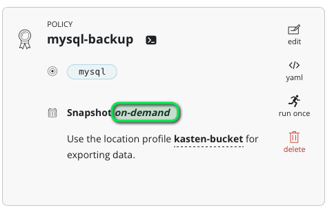
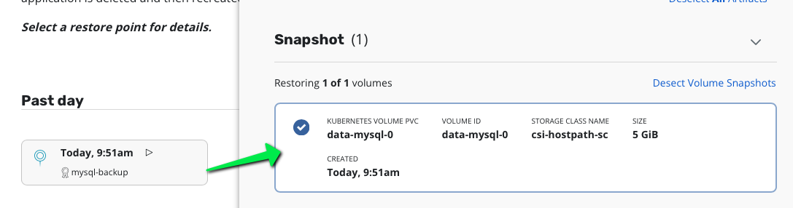

# Create a mysql app

```
kubectl create namespace mysql
cat <<EOF | kubectl apply -f -
apiVersion: apps/v1
kind: StatefulSet
metadata:
  name: mysql
  namespace: mysql
spec:
  selector:
    matchLabels:
      app: mysql
  serviceName: mysql
  replicas: 1
  template:
    metadata:
      labels:
        app: mysql
    spec:
      securityContext:
        runAsUser: 0
      containers:
      - name: mysql
        image: mysql:8.0.26
        env:
        - name: MYSQL_ROOT_PASSWORD
          value: ultrasecurepassword
        ports:
        - containerPort: 3306
          name: mysql
        volumeMounts:
        - name: data
          mountPath: /var/lib/mysql
  volumeClaimTemplates:
  - metadata:
      name: data
    spec:
      # storageClassName: basic
      accessModes: [ "ReadWriteOnce" ]
      resources:
        requests:
          storage: 5Gi
---
apiVersion: v1
kind: Service
metadata:
  creationTimestamp: null
  labels:
    app: mysql
  name: mysql
  namespace: mysql
spec:
  ports:
  - name: "3306"
    port: 3306
    protocol: TCP
    targetPort: 3306
  selector:
    app: mysql
  type: ClusterIP
EOF
```

Wait for mysql to be ready.
```
watch kubectl get po -n mysql
```


## Now create some data

Create a mysql client
```
kubectl run mysql-client --restart=Never --rm -it --image=mysql:8.0.26 -n mysql -- bash
```
Connect to the server
```
mysql --user=root --password=ultrasecurepassword -h mysql
```
Create database and data
```
CREATE DATABASE test;
USE test;
CREATE TABLE pets (name VARCHAR(20), owner VARCHAR(20), species VARCHAR(20), sex CHAR(1), birth DATE, death DATE);
INSERT INTO pets VALUES ('Puffball','Diane','hamster','f','1999-03-30',NULL);
SELECT * FROM pets;
exit
```

Exit the pods
```
exit
```


# Create a backup

Use Kasten to create a on-demand policy on this namespace and run it once.



Notice the content of the restorepoint you can see mysql-0 volumes.



Check the volumesnapshot also on the mysql namespace you see that one volumesnapshot was created

```
kubectl get volumesnapshot -n mysql
```


