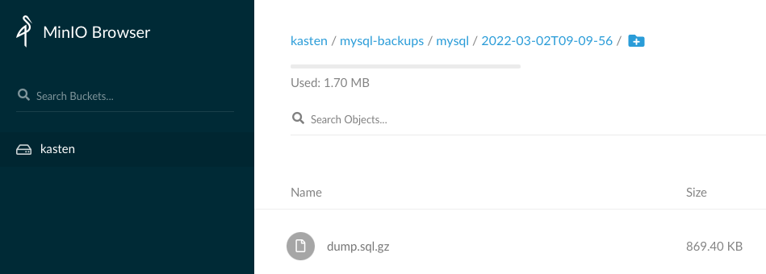

# Download and install kanctl

Kanctl is a tool that make easier the creation of the different Kanister CRD like profile or actionset.

```
curl -L https://github.com/kanisterio/kanister/releases/download/0.74.0/kanister_0.74.0_linux_amd64.tar.gz -o kanister.tar.gz
tar xvzf kanister.tar.gz
chmod +x kanctl
mv kanctl /usr/local/bin
kanctl --version
```

# Create a mysql blueprint

We have created for you the file mysql-blueprint.yaml

Let's have a look to it's backup action
```
clear
cat mysql-blueprint.yaml |grep backup: -A21
```

Take the time to understand the elements we indicate at the beginning of the challenge
- **outputArtifacts:** the output of the actionset that will be consumed by the next action set
- **phases:** the list of func that will be executed by the actions
- **func: KubeTask** This fuction will create a new container with a specific image
- **kando location push** will push the dump to the location profile
- **--profile '{{ toJson .profile}}'** this value is provided by the actionset
- **kando output s3path ${s3_path}** this action will feed the outputArtifact map and the status of the actionset

Apply this file to register the blueprint
```
kubectl create -f mysql-blueprint.yaml
```

# Create a minio S3 Kanister profile in kasten-io namespace

```
ACCESS_KEY=$(kubectl -n minio get secret kasten-minio -o jsonpath="{.data.accesskey}" | base64 --decode)
SECRET_KEY=$(kubectl -n minio get secret kasten-minio -o jsonpath="{.data.secretkey}" | base64 --decode)
kanctl create profile \
   --namespace kasten-io \
   --bucket kasten \
   --skip-SSL-verification \
   --endpoint http://$HOSTNAME.$INSTRUQT_PARTICIPANT_ID.instruqt.io:32010 \
   s3compliant \
   --access-key $ACCESS_KEY \
   --secret-key $SECRET_KEY
```


# Create a kanister actionset to execute this blueprint

```
KANISTER_PROFILE=$(kubectl get profiles.cr.kanister.io -n kasten-io -ojsonpath='{.items[0].metadata.name}')
kanctl create actionset \
   --action backup \
   --namespace kasten-io \
   --blueprint mysql-blueprint \
   --statefulset mysql/mysql \
   --profile kasten-io/$KANISTER_PROFILE
```

Check the status of the action set
```
BACKUP_ACTIONSET=$(kubectl get actionset -n kasten-io --sort-by=.metadata.creationTimestamp| grep backup |awk '{print $1}'|tail -1)
kubectl get actionset -n kasten-io $BACKUP_ACTIONSET -ojsonpath='{.status}' |jq
```

In this status you'll find out the path on the s3 bucket where the dump has been put away.

Check using the minio dashboard that you retreive the dump at this path.



# Now delete the database and restore


Enter mysql pod
```
kubectl run mysql-client --restart=Never --rm -it --image=mysql:8.0.26 -n mysql -- bash
```


Connect to the server
```
mysql --user=root --password=ultrasecurepassword -h mysql
```


Delete the database test
```
drop database test;
```

Exit the database and the pod.

Create an actionset that consume the output artifact created by the previous actionset

```
kanctl --namespace kasten-io create actionset --action restore --from $BACKUP_ACTIONSET
```

Check the status of the action set
```
RESTORE_ACTIONSET=$(kubectl get actionset -n kasten-io --sort-by=.metadata.creationTimestamp | grep restore |awk '{print $1}'|tail -1)
kubectl get actionset -n kasten-io $RESTORE_ACTIONSET -ojsonpath='{.status}' |jq
```

Check your database is back up and running.

# Create a delete actionset

Your turn, find a way to create a delete actionset, check its status, and check on minio that dump
has been deleted.

Tip: The context of the deletion of an artifact is not the existing statefulset, because your statefulset may
have been deleted. It's why the delete action use a higher context `Namespace.Name` instead of `Statefulset.Name`.

To overide the context object provided by the from action use the option `--namespacetargets`

```
kanctl create actionset --help
```

# To debug the kubestask

Debugging the Kubetask could be challenging as it's an ephemeral container.

You can follow what's going on inside your kanister pod with this command.

```
while true; do kubectl logs -f -n mysql -l createdBy=kanister; sleep 2; done
```


