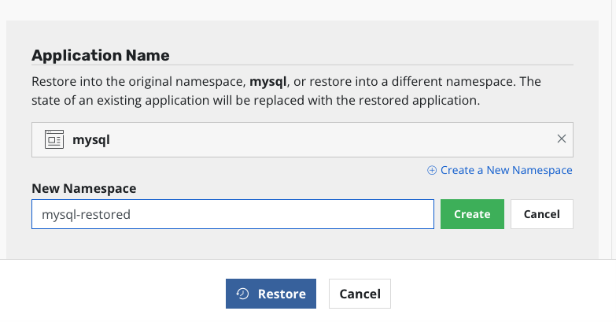

# Let Kasten create the actionset for you

Previously we created an actionset manually. What we want is having Kasten
do it each time it backups the mysql namespace.

The only thing to do is to annotate the statefulset with an annotation that indicate the blueprint to apply.

```
kubectl --namespace mysql annotate statefulset/mysql kanister.kasten.io/blueprint=mysql-blueprint
```

Now each time Kasten backup, restore or delete a restorepoint it will also create an actionset.

- The value of the annotation become the `--blueprint` option in `kanctl`command
- The object annotated replace the `--statefulset` option in `kanctl`command
- the action is backup, restore or delete depending of your action on the restorepoint
- The kanister profile will be created from the Kasten profile you indicate in your policy or backup action

# Backup with Kasten

Go on the Kasten dashboard and run once again the policy.

You must observe that a kanister pod execute. It's executing the backup action.

Check on minio that now you have a new dump. Notice that now the dump are
automatically put in the cluster folder

```
ACCESS_KEY=$(kubectl -n minio get secret kasten-minio -o jsonpath="{.data.accesskey}" | base64 --decode)
echo $ACCESS_KEY
SECRET_KEY=$(kubectl -n minio get secret kasten-minio -o jsonpath="{.data.secretkey}" | base64 --decode)
echo $SECRET_KEY
```


Now go to the restore point you can see that no volume is present

because it's been replaced by the dump.


Notice also that no extra volumesnapshot has been created on the mysql namespace.
```
kubectl -n mysql get volumesnapshot
```

All that was possible because we use the name `backup`, `restore` and `delete` for the actions in the blueprint.

Kasten execute them when it backup, restore or delete. If your actions had others names they won't be called by Kasten.

# Restore with Kasten

Now restore in another namespace (mysql-restored) with Kasten:



During the restoration process you must observe that a kanister pod execute when mysql-0 pod is up and running. It's executing the restore action.

```
while true; do kubectl logs -f -n mysql-restored -l createdBy=kanister; sleep 2; done
```

Check the content of your database. The test database should be there.

Enter mysql pod
```
kubectl run mysql-client --restart=Never --rm -it --image=mysql:8.0.26 -n mysql-restored -- bash
```


Connect to the server
```
mysql --user=root --password=ultrasecurepassword -h mysql
```

Check test databases is there
```
show databases;
```

# Delete a restore point

Also delete a restorepoint using the Kasten Dashboard and verify the corresponding dump is deleted


Check the retireaction is successful


And check also on minio that the corresponding dump folder is gone.