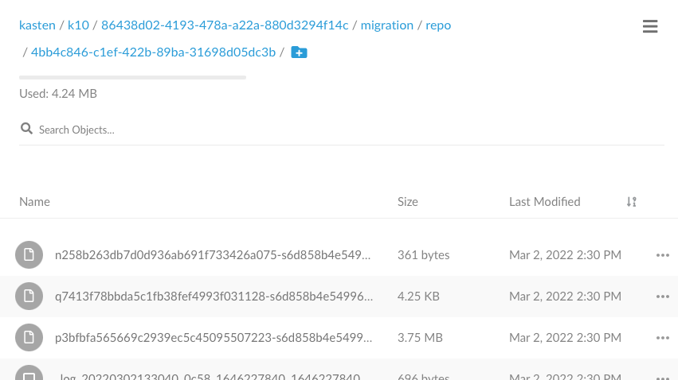
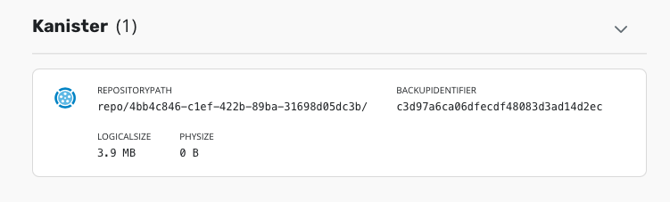

# Create the mysql blueprint v2

We have created for you the file mysql-blueprint-v2.yaml

Apply this file to register the blueprint to kanister
```
kubectl create -f mysql-blueprint-v2.yaml
```

Check the output section on the backup section

```
clear
cat mysql-blueprint-v2.yaml |grep backup: -A23
```

The fact that `kopiaSnapshot`is in the outputArtifacts section
```
clear
cat mysql-blueprint-v2.yaml |grep outputArtifacts: -A5
```

Let Kasten understand that we are dealing with a blueprint V2 and that
kando must be configured with Kopia instead of Restic.

# This blueprint use kopia

This blueprint leverage the strong datamover Kopia integration. Your dump are following the same workflow than pvc.
However this blueprint can't be used with kanister only, it has to be used with Kasten.

# Replace the annotation

```
kubectl --namespace mysql annotate statefulset/mysql kanister.kasten.io/blueprint=mysql-blueprint-v2 --overwrite
```

# Backup with Kasten

Go on the Kasten dashboard and run once again the policy.

Check on minio that now you don't have anymore new dump, but instead a new kopia repo has been created.



Now go to the restore point you can see the behaviour is the same, no volume is present because it's been replaced by the dump but the kanister output artifact are different.



Notice also that no extra volumesnapshot has been created on the mysql namespace as in the previous case.

# Restore with Kasten

Now restore in another namespace with Kasten (mysql-restored2), during the restoration process you must observe that a kanister pod
execute the restoration process.

Check the content of your database.

Enter mysql pod
```
kubectl run mysql-client --restart=Never --rm -it --image=mysql:8.0.26 -n mysql-restored2 -- bash
```


Connect to the server
```
mysql --user=root --password=ultrasecurepassword -h mysql
```


Check test databases is there
```
show databases;
```