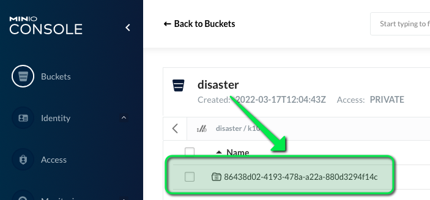

# Install Kasten

On the k8s terminal launh the installation of Kasten

```console
helm repo add kasten https://charts.kasten.io/
helm repo update

kubectl create ns kasten-io

# install a lab licence
kubectl create -f license-secret.yaml

helm install k10 kasten/k10 --namespace=kasten-io
```

To ensure that Kasten K10 is running, check the pod status to make sure they are all in the `Running` state:

```console
watch -n 2 "kubectl -n kasten-io get pods"
```

Once all pods have a Running status, hit `CTRL + C` to exit `watch`.

# Configure the Local Storage System

Once K10 is running, use the following commands to configure the local storage system.

```console
kubectl annotate volumesnapshotclass csi-hostpath-snapclass k10.kasten.io/is-snapshot-class=true
```

# Expose the K10 dashboard

While not recommended for production environments, let's set up access to the K10 dashboard by creating a NodePort. Let's first create the configuration file for this:

```console
cat > k10-nodeport-svc.yaml << EOF
apiVersion: v1
kind: Service
metadata:
  name: gateway-nodeport
  namespace: kasten-io
spec:
  selector:
    service: gateway
  ports:
  - name: http
    port: 8000
    nodePort: 32000
  type: NodePort
EOF
```

Now, let's create the actual NodePort Service

```console
kubectl apply -f k10-nodeport-svc.yaml
```
# View the K10 Dashboard

Once completed, you should be able to view the K10 dashboard in the other tab on the left.

# Create a location profile pointing to the minio installation on the "datacenter east"

In the Kasten dashboard go to Settings > Location profile > Create a S3 compatible profile

- name: backup
- access_key: minioadmin
- secret_key: minioadmin
- endpoint:
```
echo http://minio.${_SANDBOX_ID}.instruqt.io:9000
```
- bucket: disaster

Once you validate, the bucket is automatically created and can be checked on the minio console.



Notice the uuid of the cluster after the k10/ prefix, this is the uuid of default namespace.

It's a way to give to the cluster a unique id and also to be able to manage many cluster for the same location.

