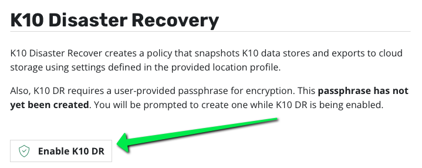
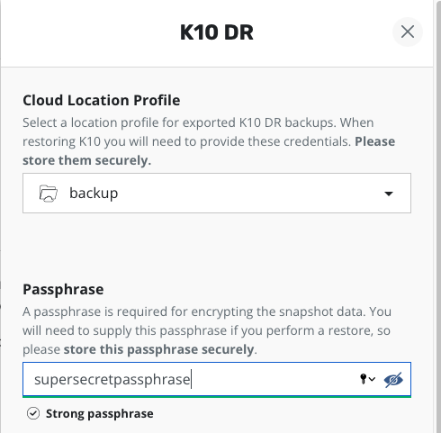
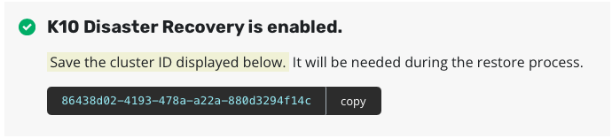
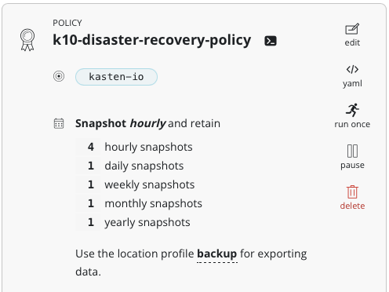
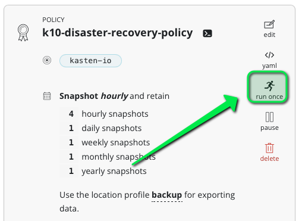
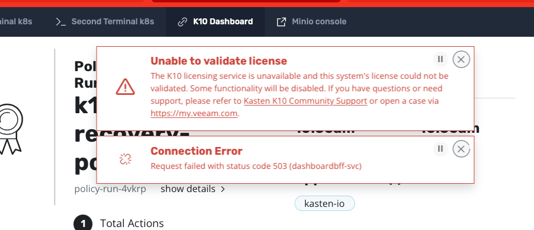

# Activate disaster recovery

Go to Settings > Disaster Recovery and click on "Enable K10 DR".



You'll be prompted for a passphrase, this string will be used to generate the encryption key for the catalog.



Remember : catalog hold the keys for the exported backup and you hold the key for the exported catalog. Hence you can see this key as a master key.

One you click "Enable K10 DR" you can see that a the uid of the cluster is displayed, it's the same uid you noticed in minio bucket after the prefix k10/.



Copy this uid and passphrase in your keypass.

This also creates the k10-disaster-recovery-policy policy which by default hourly.



Run it once.



# Create a disaster

Now we are going to create a disaster on the cluster by filling up the filesystem.

Fill up the filesystem
```
dd if=/dev/urandom of=too-big-file.txt
```

Use the second terminal to regulary check the size of this file growing
```
watch ls -alh too-big-file.txt
```

Type Ctr-C when you the size of the file go over 80G.

Quickly you can see that kubernetes does not respond anymore

```
kubectl get po -A
```

Does not return and you have to CTR-C. Sooner the cluster won't be usable anymore ...

If you check the K10 dashboard you see a lot of error messages



Congratulation, you have successfully created a disaster !! ;-) You can't use anymore your cluster.

Time now to see now how we are going to recover of this situation.