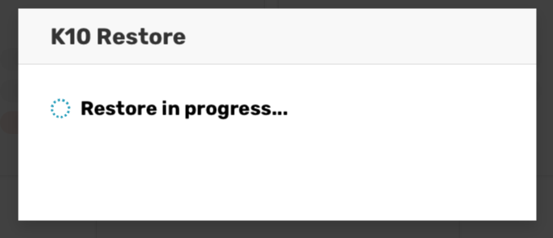
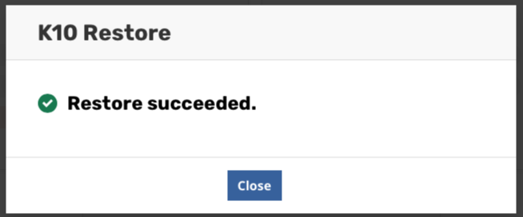
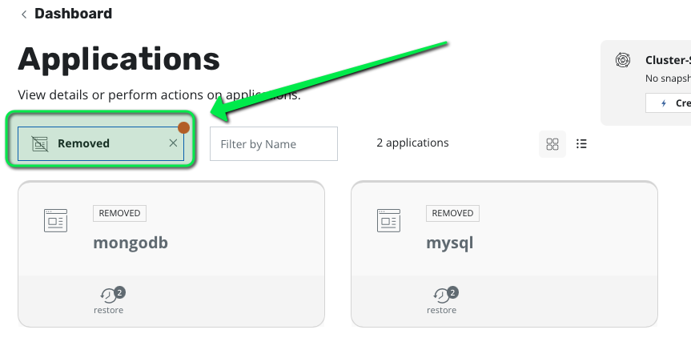
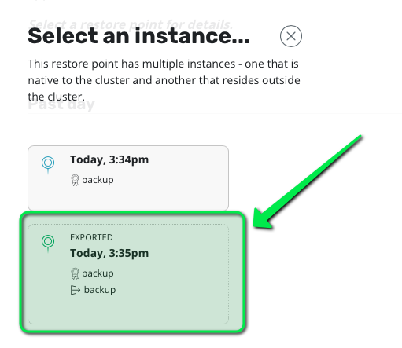
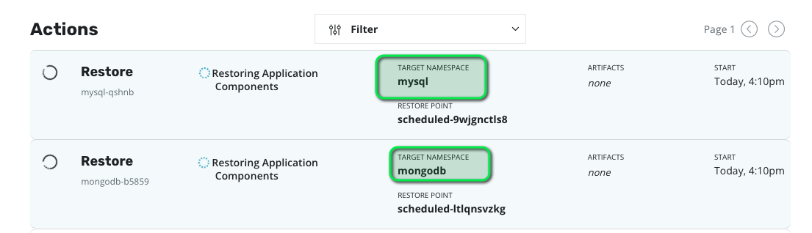

# Let's check the state of our initial cluster

Open the Terminal k8s tab and check the state of the cluster.

Something really went bad
```
kubectl get pod -A
```

The output look like that
```
I0318 10:22:26.422184  112151 request.go:655] Throttling request took 1.190816176s, request: GET:https://127.0.0.1:40635/apis/reporting.kio.kasten.io/v1alpha1?timeout=32s
I0318 10:22:36.622181  112151 request.go:655] Throttling request took 8.599144509s, request: GET:https://127.0.0.1:40635/apis/node.k8s.io/v1beta1?timeout=32s
```
and you never get a response ...

Let's imagine that finding out the cause and repairing would be too long or just impossible (which is often true).

You need to restore quickly your applications.

# Let's recover on a disaster recovery cluster

Hopefully we have enabled the K10 disaster recovery and we had a standby/dr cluster waiting for this situation.

In real life you keep the number of nodes of the standby cluster to reduce the cost. And you may have to increase the number of nodes
of this cluster to make him able to handle the workloads. In our lab we just use a one node cluster so we'll skip this step.

First we need to resinstall Kasten on this cluster and reinstall the Location profile


# Install Kasten

On the k8s terminal DR launh the installation of Kasten

```console
helm repo add kasten https://charts.kasten.io/
helm repo update

kubectl create ns kasten-io

# install a lab licence
kubectl create -f license-secret.yaml

helm install k10 kasten/k10 --namespace=kasten-io
```

To ensure that Kasten K10 is running, check the pod status to make sure they are all in the `Running` state:

```console
watch -n 2 "kubectl -n kasten-io get pods"
```

Once all pods have a Running status, hit `CTRL + C` to exit `watch`.

# Configure the Local Storage System

Once K10 is running, use the following commands to configure the local storage system.

```console
kubectl annotate volumesnapshotclass csi-hostpath-snapclass k10.kasten.io/is-snapshot-class=true
```

# Expose the K10 dashboard

While not recommended for production environments, let's set up access to the K10 dashboard by creating a NodePort. Let's first create the configuration file for this:

```console
cat > k10-nodeport-svc.yaml << EOF
apiVersion: v1
kind: Service
metadata:
  name: gateway-nodeport
  namespace: kasten-io
spec:
  selector:
    service: gateway
  ports:
  - name: http
    port: 8000
    nodePort: 32000
  type: NodePort
EOF
```

Now, let's create the actual NodePort Service

```console
kubectl apply -f k10-nodeport-svc.yaml
```
# View the K10 Dashboard

Once completed, you should be able to view the K10 dashboard in the tab .

# Create a location profile pointing to the minio installation on the "datacenter east"

In the Kasten dashboard go to Settings > Location profile > Create a S3 compatible profile

- name: backup
- access_key: minioadmin
- secret_key: minioadmin
- endpoint:
```
echo http://minio.${_SANDBOX_ID}.instruqt.io:9000
```
- bucket: disaster

# Now it's time to activate the recovery

Create the k10-dr-secret

```
kubectl create secret generic k10-dr-secret \
   --namespace kasten-io \
   --from-literal key=<passphrase>
```

Where passphrase is the passphrase that you copy in the previous steps.

And now launch the recovery

```
helm install k10-restore kasten/k10restore --namespace=kasten-io \
    --set sourceClusterID=<source-clusterID> \
    --set profile.name=<location-profile-name>
```

<location-profile-name> should be `backup` if you follow the previous step and <souce-clusterID> is the uid that you store
in your keypass in the previous challenge.

You should see this popup in the dashboard.



Then when it's finished this one.

]

Congratulation you have recovered the catalog but you still have to recover the applications.

# Recover the applications

Now go in Applications > Non Compliant > Deleted

You can see your 2 apps mysql and mongodb.



Applications appears as removed because there is restorepoint of the appication on the cluster but not the corresponding namespace.

Choose the exported restore point (not the local restore point because you lost the local snapshot)



And click restore. You should see the restoration process on going.



Once all app restored check that datas are also there

# check Mysql

Create a mysql client
```
kubectl run mysql-client --restart=Never --rm -it --image=mysql:8.0.26 -n mysql -- bash
```
Connect to the server
```
mysql --user=root --password=ultrasecurepassword -h mysql
```
Check data
```
USE test;
SELECT * FROM pets;
exit
```

Exit the pods
```
exit
```

# Check mongodb

Run a mongo client
```console
export MONGODB_ROOT_PASSWORD=$(kubectl get secret --namespace mongodb mongo-mongodb -o jsonpath="{.data.mongodb-root-password}" | base64 --decode)
kubectl run --namespace mongodb mongo-mongodb-client --rm --tty -i --restart='Never' --env="MONGODB_ROOT_PASSWORD=$MONGODB_ROOT_PASSWORD" --image docker.io/bitnami/mongodb:4.4.11-debian-10-r12 --command -- mongo admin --host "mongo-mongodb-0.mongo-mongodb-headless:27017,mongo-mongodb-1.mongo-mongodb-headless:27017" --authenticationDatabase admin -u root -p $MONGODB_ROOT_PASSWORD
```

Check data are there
```
db.log.find()
```

When all seems good you can exit
```
exit
```

# Congratulations !

You have completly recover from the disaster. Hope you enjoyed this track do not hesitate to give your feedback.