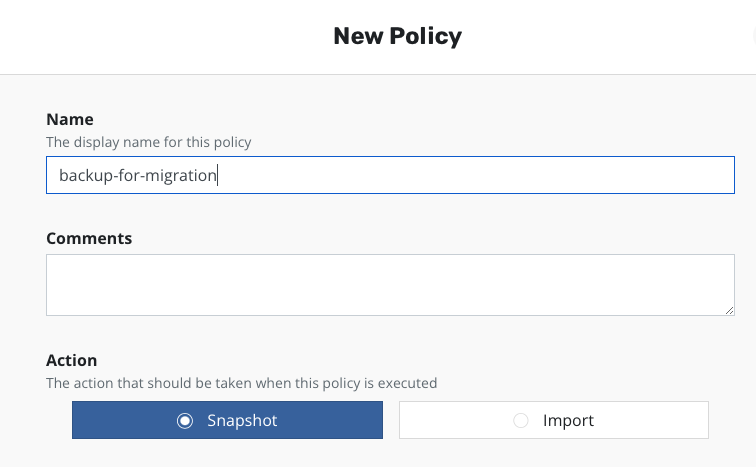
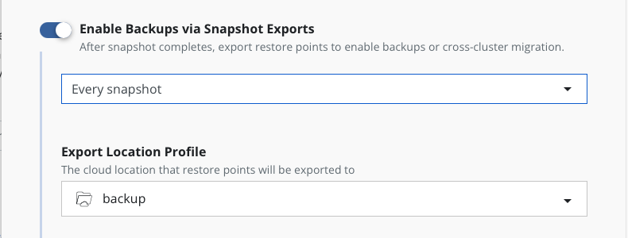
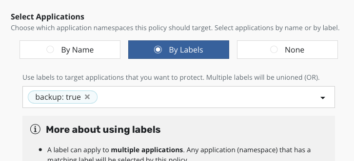
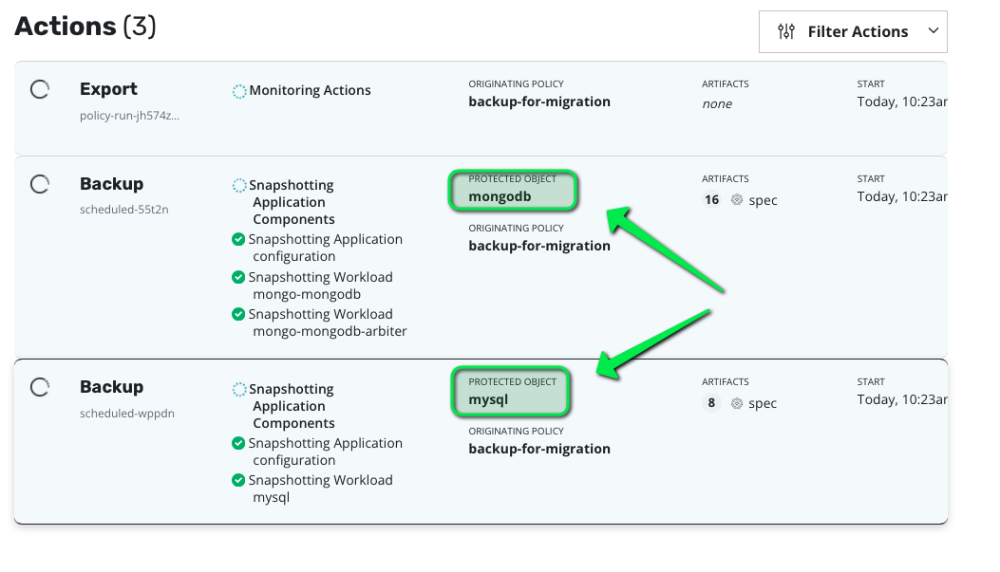

# Create a mysql app

```
kubectl create namespace mysql
cat <<EOF | kubectl apply -f -
apiVersion: apps/v1
kind: StatefulSet
metadata:
  name: mysql
  namespace: mysql
spec:
  selector:
    matchLabels:
      app: mysql
  serviceName: mysql
  replicas: 1
  template:
    metadata:
      labels:
        app: mysql
    spec:
      securityContext:
        runAsUser: 0
      containers:
      - name: mysql
        image: mysql:8.0.26
        env:
        - name: MYSQL_ROOT_PASSWORD
          value: ultrasecurepassword
        ports:
        - containerPort: 3306
          name: mysql
        volumeMounts:
        - name: data
          mountPath: /var/lib/mysql
  volumeClaimTemplates:
  - metadata:
      name: data
    spec:
      # storageClassName: basic
      accessModes: [ "ReadWriteOnce" ]
      resources:
        requests:
          storage: 5Gi
---
apiVersion: v1
kind: Service
metadata:
  creationTimestamp: null
  labels:
    app: mysql
  name: mysql
  namespace: mysql
spec:
  ports:
  - name: "3306"
    port: 3306
    protocol: TCP
    targetPort: 3306
  selector:
    app: mysql
  type: ClusterIP
EOF
```

Wait for mysql to be ready.
```
watch kubectl get po -n mysql
```


## Now create some data

Create a mysql client
```
kubectl run mysql-client --restart=Never --rm -it --image=mysql:8.0.26 -n mysql -- bash
```
Connect to the server
```
mysql --user=root --password=ultrasecurepassword -h mysql
```
Create database and data
```
CREATE DATABASE test;
USE test;
CREATE TABLE pets (name VARCHAR(20), owner VARCHAR(20), species VARCHAR(20), sex CHAR(1), birth DATE, death DATE);
INSERT INTO pets VALUES ('Puffball','Diane','hamster','f','1999-03-30',NULL);
SELECT * FROM pets;
exit
```

Exit the pods
```
exit
```


# Create a mongodb application

```console
helm repo add bitnami https://charts.bitnami.com/bitnami
kubectl create namespace mongodb
helm install mongo bitnami/mongodb --namespace mongodb \
    --set architecture="replicaset"
```

To ensure that mongodb is running, check the pod status to make sure they are all in the `Running` state:

```console
watch -n 2 "kubectl -n mongodb get pods"
```

Once all pods have a `Running` status, hit `CTRL + C` to exit watch and then run the following commands to create a collection with some data.


Run a mongo client
```console
export MONGODB_ROOT_PASSWORD=$(kubectl get secret --namespace mongodb mongo-mongodb -o jsonpath="{.data.mongodb-root-password}" | base64 --decode)
kubectl run --namespace mongodb mongo-mongodb-client --rm --tty -i --restart='Never' --env="MONGODB_ROOT_PASSWORD=$MONGODB_ROOT_PASSWORD" --image docker.io/bitnami/mongodb:4.4.11-debian-10-r12 --command -- mongo admin --host "mongo-mongodb-0.mongo-mongodb-headless:27017,mongo-mongodb-1.mongo-mongodb-headless:27017" --authenticationDatabase admin -u root -p $MONGODB_ROOT_PASSWORD
```

Now create data
```
db.createCollection("log", { capped : true, size : 5242880, max : 5000 } )
db.log.insert({ item: "card", qty: 15 })
db.log.insert({ item: "dice", qty: 3 })
db.log.find()
```

When all seems good you can exit
```
exit
```

# Create a label policy on datacenter west

Label the two applications with backup=true

```
kubectl label ns mysql mongodb backup=true
```

On K10 west dashboard create a policy directly from the policies tiles.

Name it "backup-for-migration"



Choose the frequency to daily and enable export to the backup location profile


and choose select by label
```
backup:true
```


Make sure your run this policy at least once by clicking "Run Once".

You should see the policy trigger a backup action for the two namespaces having this label.



