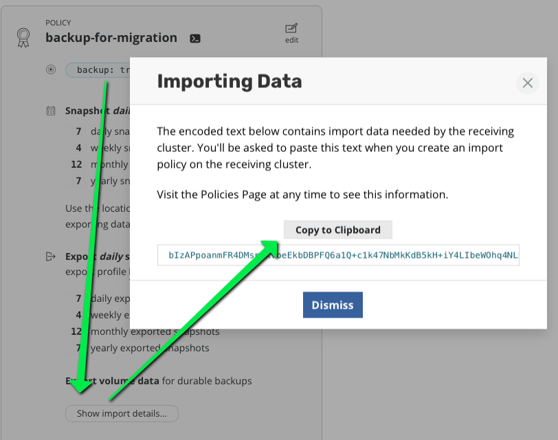
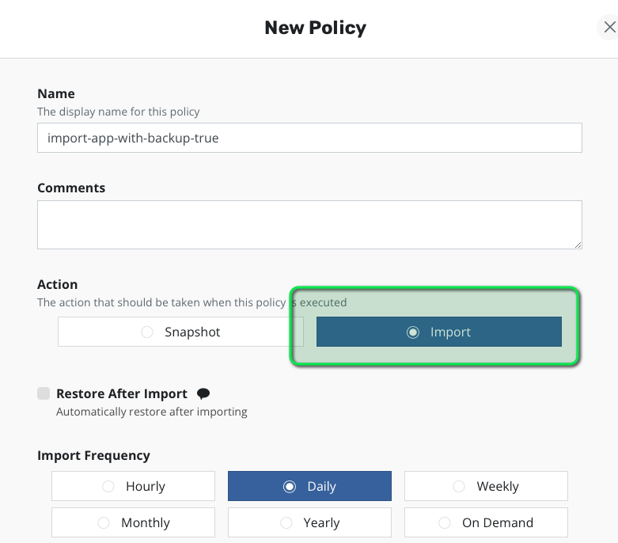
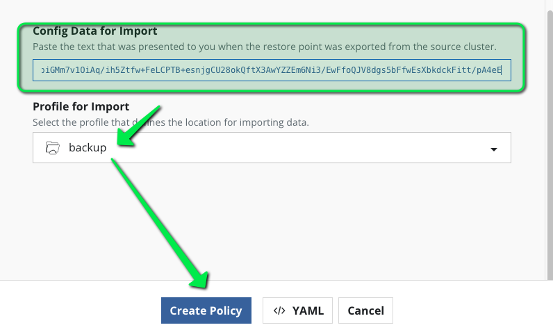
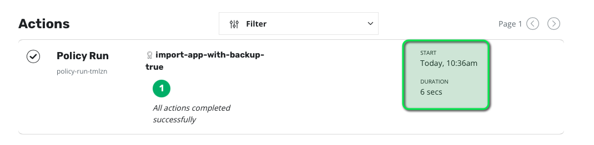
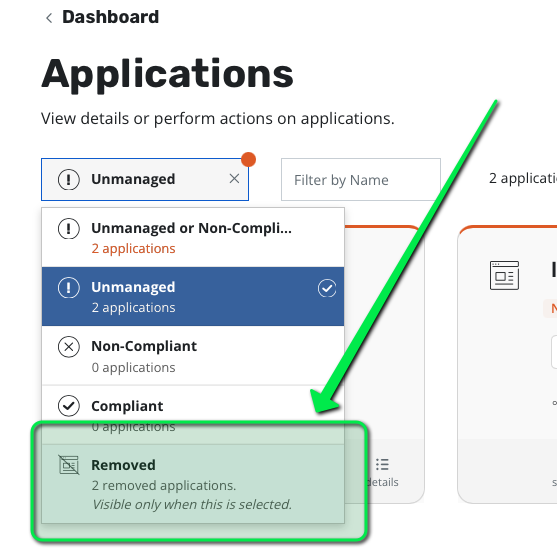
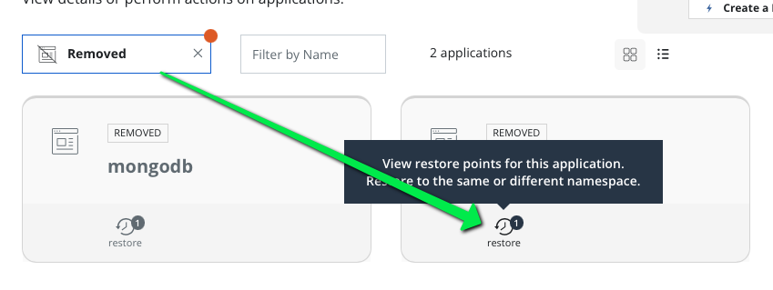
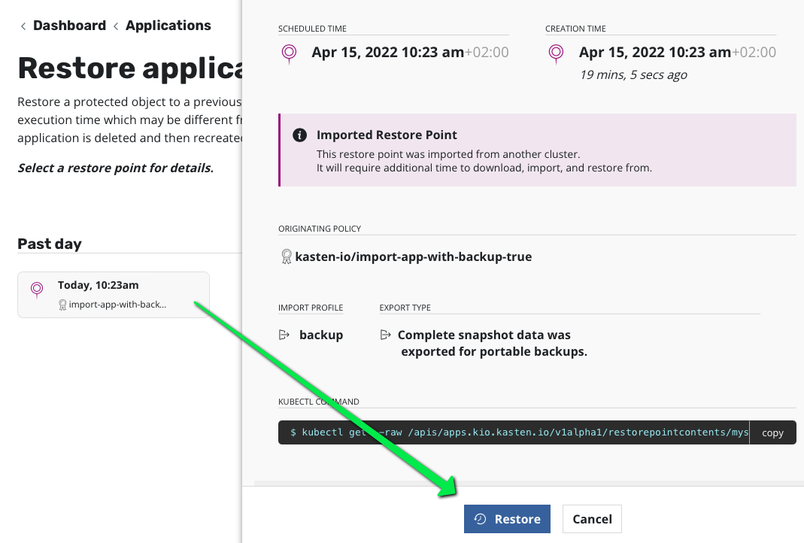
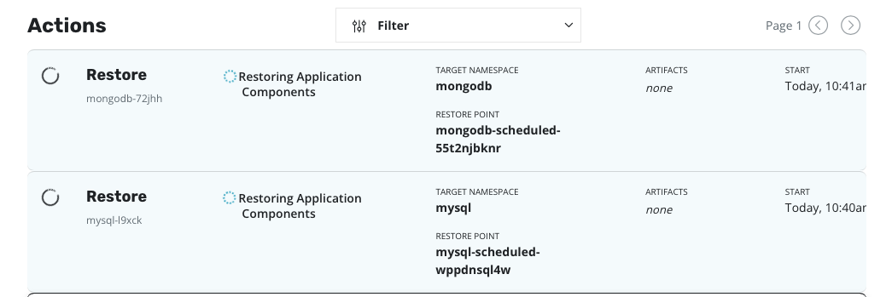

# Obtain the migration token from the soucer cluster (datacenter west)

In the k10 west tab use the import details on the policy that you just created.

Click on copy to save this value in you clipboard.



This migration token contains 2 main elements :
- the path to your restorepoints on the location profile (here minio)
- the encryption keys used by kopia (the datamover) for encrypting the data on the location profile

# Create an import policy on destination cluster (datacenter east)

WARNING : the rest of the actions in this challenge are now on *datacenter east*, both dasboard and command line.

On the k10 east tab create an import policy (use the same policy than the backup policy in datacenter west)



Paste the migration token.



Automatically Kasten select the location profile that has the same attribute than the location profile defined on the source cluster (datacenter west).

Create it and run it once. This should not take long because we just import restore point.



# Use the restorepoint to restore the applications

Still in the destination cluster go in applications > deleted you should see mysql and mongodb.



They appear as deleted in the dashboard because their restorepoint exist but not their namespaces.

Choose the mysql restore point



and click restore.



Do the same thing with mongodb.

On the dashborad you should see the thow restore action on going.



# Verify data are also restored

## Check Mysql
Create a mysql client
```
kubectl run mysql-client --restart=Never --rm -it --image=mysql:8.0.26 -n mysql -- bash
```
Connect to the server
```
mysql --user=root --password=ultrasecurepassword -h mysql
```
Check the database test
```
USE test;
SELECT * FROM pets;
exit
```

Exit the pods
```
exit
```

## Check Mongo
Run a mongo client
```console
export MONGODB_ROOT_PASSWORD=$(kubectl get secret --namespace mongodb mongo-mongodb -o jsonpath="{.data.mongodb-root-password}" | base64 --decode)
kubectl run --namespace mongodb mongo-mongodb-client --rm --tty -i --restart='Never' --env="MONGODB_ROOT_PASSWORD=$MONGODB_ROOT_PASSWORD" --image docker.io/bitnami/mongodb:4.4.11-debian-10-r12 --command -- mongo admin --host "mongo-mongodb-0.mongo-mongodb-headless:27017,mongo-mongodb-1.mongo-mongodb-headless:27017" --authenticationDatabase admin -u root -p $MONGODB_ROOT_PASSWORD
```

Verify the log collection
```
db.log.find()
```

When all seems good you can exit
```
exit
```