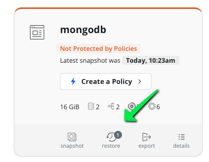
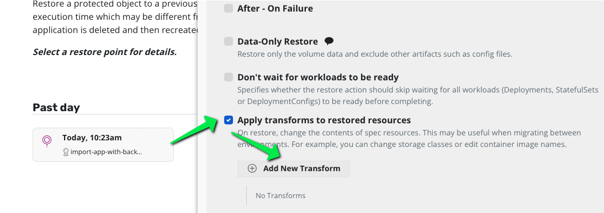
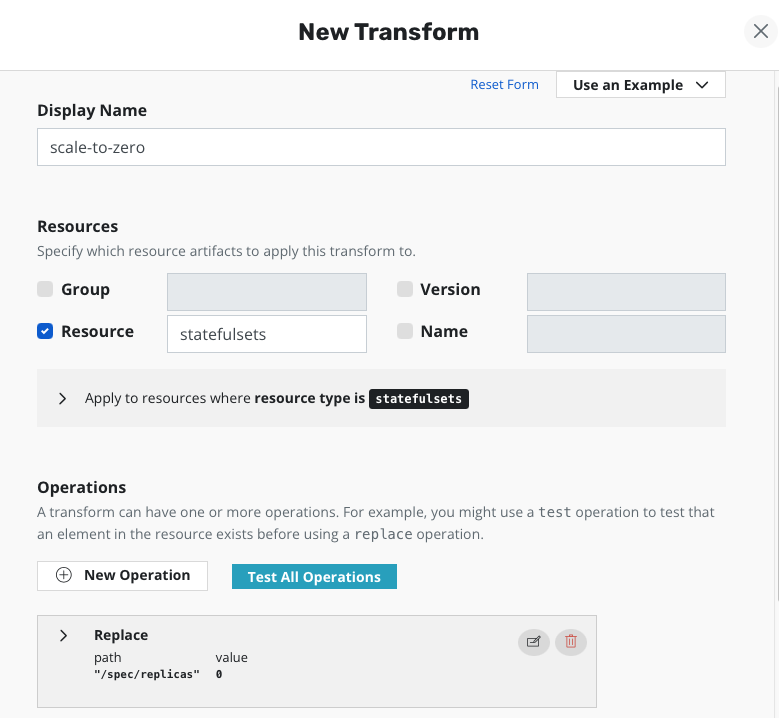
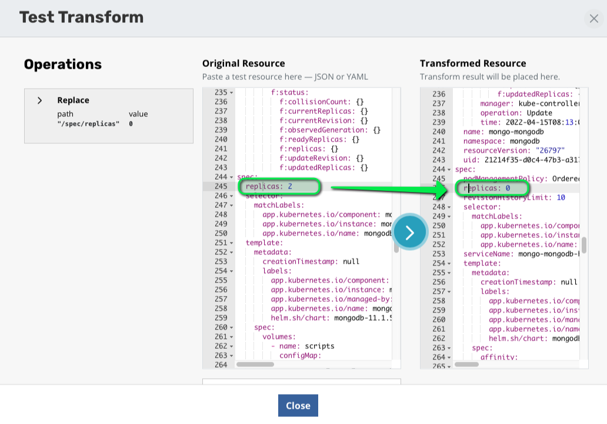
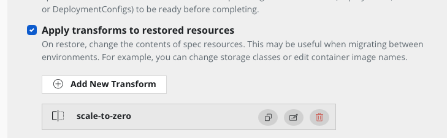
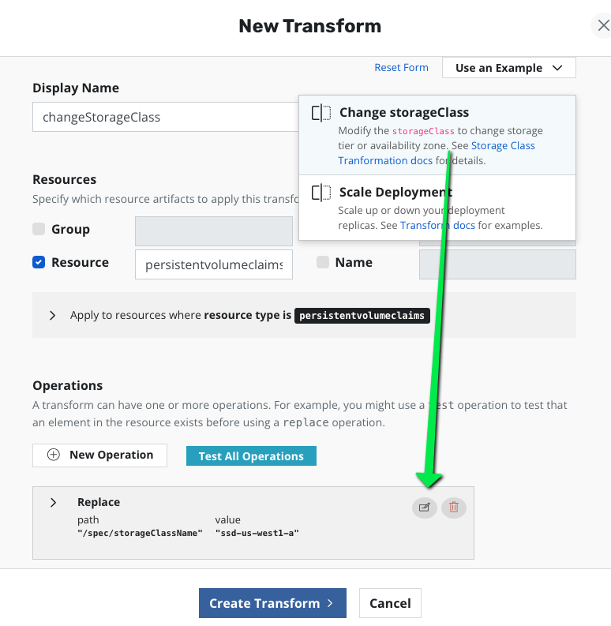
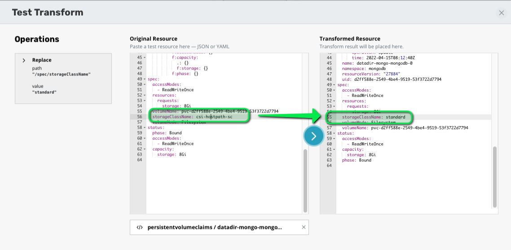
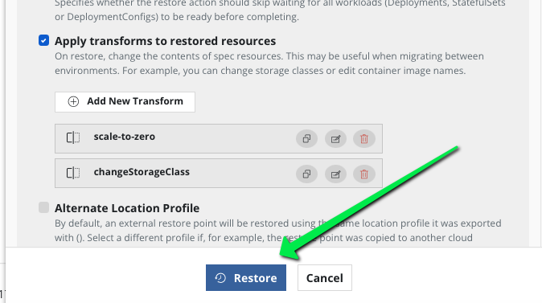

# On the destination cluster (datacenter east)

Navigate to the mongodb application and find the restore points.



## Create a first transform to set the replicas to zero.

Enable transform and click add a transformation.



Give the name "scale-to-zero"

In the resource selector choose "Statefulset"

In the operation choose the first "Replace" (not the regex replace)

In the json path choose "/spec/replicas" and choose the litteral 0 in the value (not the string "0")



Now test your transform by clicking "Test All Operations"

Choose the mongodb statefulset spec to load the yaml and observe the value of the replicas it should be 2

Now click on the Arrow in the middle and observe the value of the replicas it should zero.



Close the test panel and click on "edit transform" and "create transform"



## Create a second transform to change the storage class

Click again on add a transformation but this time choose from an example

Select the "change storage class" example.

Edit the transform and replace the value "ssd-east-1" by the non default storage class on the cluster : "standard"



Now test your transform by clicking "Test operation"

Choose one persistent volume claim spec to load the yaml and observe the value of the storageclassname field it should be "csi-hostpath"

Now click on the Arrow in the middle and observe the value of the storageclassname field it should be "local storage".



Close the test panel and click on "edit transform" and "create transform"

# Launch the restore and check

Click restore with this 2 transforms.



Once the restore is over verify that no pods are running and that mongodb is scaled to zero

```
kubectl get sts -n mongodb
```

You should see all the replicas at zero.


Check the storage class of the PVC
```
kubectl get pvc -n mongodb
```

# Verify data are also restored

First scale up the workload
```
kubectl scale sts mongo-mongodb -n mongodb --replicas=2
kubectl scale sts mongo-mongodb-arbiter -n mongodb --replicas=1
```

To ensure that mongodb is running, check the pod status to make sure they are all in the `Running` state:

```console
watch -n 2 "kubectl -n mongodb get pods"
```

Now you can check your data.

Run a mongo client
```console
export MONGODB_ROOT_PASSWORD=$(kubectl get secret --namespace mongodb mongo-mongodb -o jsonpath="{.data.mongodb-root-password}" | base64 --decode)
kubectl run --namespace mongodb mongo-mongodb-client --rm --tty -i --restart='Never' --env="MONGODB_ROOT_PASSWORD=$MONGODB_ROOT_PASSWORD" --image docker.io/bitnami/mongodb:4.4.11-debian-10-r12 --command -- mongo admin --host "mongo-mongodb-0.mongo-mongodb-headless:27017,mongo-mongodb-1.mongo-mongodb-headless:27017" --authenticationDatabase admin -u root -p $MONGODB_ROOT_PASSWORD
```

Verify the log collection
```
db.log.find()
```

When all seems good you can exit
```
exit
```