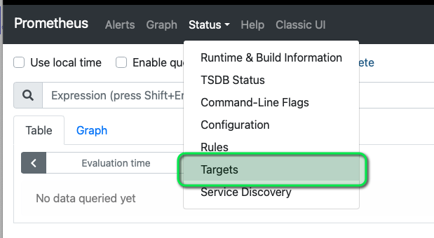
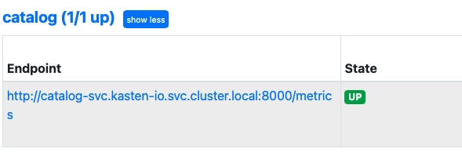
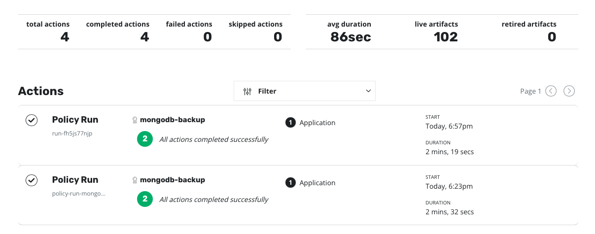
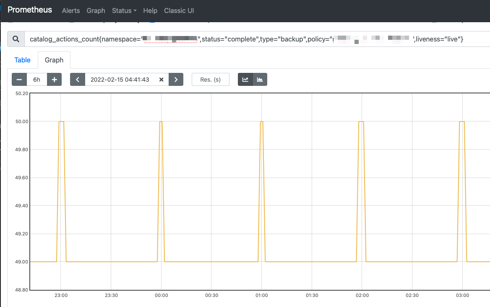
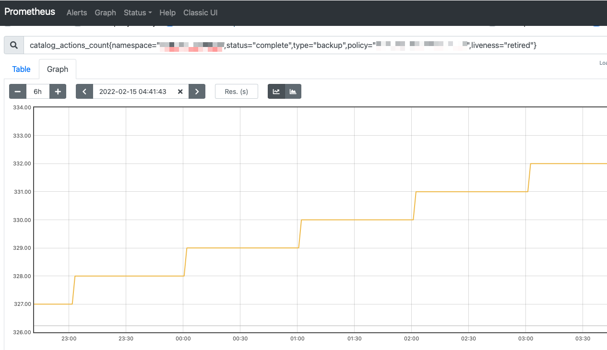
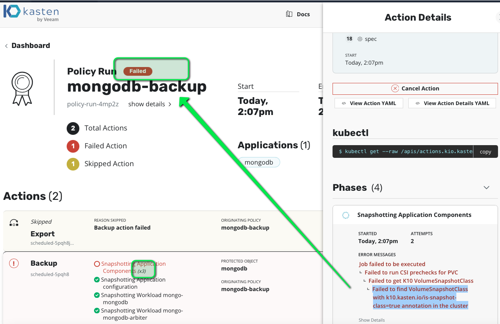
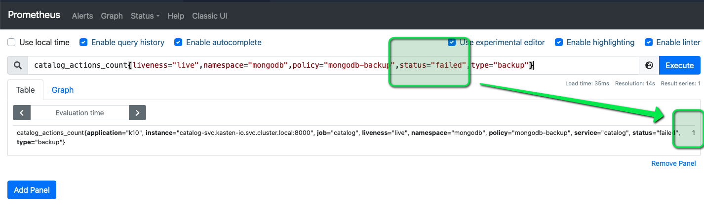

Now that we have exerciced Kasten with a backup we have enough metrics available.

First let's find out the scraping endpoints which are available.

Open the K10 prometheus tab available under the URI `/k10/prometheus/graph`.

And choose the targets menu under Status



You can see now the different endpoints, one of the most interesting is the one exposed by the catalog.



Of course this url
```
http://catalog-svc.kasten-io.svc.cluster.local:8000/metrics
```

Is only resolvable internally, inside the cluster.

Hence we're going to curl from a pod.
The first execution can be slow as it require to pull the images on the node.
```
kubectl run catalog-metrics --restart=Never -n kasten-io -it  --image=curlimages/curl -- curl http://catalog-svc.kasten-io.svc.cluster.local:8000/metrics
kubectl logs catalog-metrics -n kasten-io
```

You should get a lot of information search for catalog_actions_count you should see something like this:
```
# HELP catalog_actions_count Number of actions
# TYPE catalog_actions_count gauge
catalog_actions_count{liveness="live",namespace="mongodb",policy="mongodb-backup",status="complete",type="backup"} 2
catalog_actions_count{liveness="live",namespace="mongodb",policy="mongodb-backup",status="pending",type="backup"} 0
catalog_actions_count{liveness="live",namespace="mongodb",policy="mongodb-backup",status="running",type="backup"} 0
catalog_actions_count{liveness="retired",namespace="",policy="mongodb-backup",status="complete",type="export"} 2
catalog_actions_count{liveness="retired",namespace="",policy="mongodb-backup",status="pending",type="export"} 0
catalog_actions_count{liveness="retired",namespace="",policy="mongodb-backup",status="running",type="export"} 0
```

The two comments you can read at the beginning are the documenation of the metrics
```
# HELP catalog_actions_count Number of actions
# TYPE catalog_actions_count gauge
```

The type can be gauge, histogram or counter
- counter is a cumulative value like the number of request served, counter always increase unless they are reset to zero
- gauge is a metric that represents a single numerical value that can arbitrarily go up and down like temperatures or current memory usage
- histogram and summary, they are more complex and are used to sample observations in buckets

So now we can understand what means this metrics values :

```
catalog_actions_count{liveness="live",namespace="mongodb",policy="mongodb-backup",status="complete",type="backup"} 2
catalog_actions_count{liveness="live",namespace="mongodb",policy="mongodb-backup",status="pending",type="backup"} 0
catalog_actions_count{liveness="live",namespace="mongodb",policy="mongodb-backup",status="running",type="backup"} 0
catalog_actions_count{liveness="retired",namespace="",policy="mongodb-backup",status="complete",type="export"} 2
catalog_actions_count{liveness="retired",namespace="",policy="mongodb-backup",status="pending",type="export"} 0
catalog_actions_count{liveness="retired",namespace="",policy="mongodb-backup",status="running",type="export"} 0
```

There was
- 2 backupactions that were complete for the mongodb-backup policy, 0 were/are pending or running.
- 2 exportactions that were complete for the mongodb-backup policy, 0 were/are pending or running.

This is consistent with what we can see on the corresponding dashboard



# What those metrics really means ?

It's important to understand that metrics are exposed by the component and even if they look nearly the same they may
have a different meaning.

For instance
```
catalog_actions_count{liveness="live",namespace="mongodb",policy="mongodb-backup",status="complete",type="backup"}
```

Means actually the number of successful resorepoint on the mongodb that are available. This value is a Gauge and
not a counter because it changes. When retention policy is fulled there is always restorepoint which is created and
a restorepoint which is retired.

This example is taken from a long running hourly policy.



Now if you take the metrics
```
catalog_actions_count{liveness="retired",namespace="mongodb",policy="mongodb-backup",status="complete",type="backup"}
```



The only difference is the criteria `liveness="retired"` instead of `liveness="live"` which means that the number of restorepoint
that we retire along the time is always growing.

Now on this same cluster we can check that first metric is the number of backupactions.

```
kubectl get backupaction -n xxxxxyyyyy --no-headers -l k10.kasten.io/policyName=xxxxxyyyyy-backup |wc -l
50
```

Now the other metric (the one with `liveness="retired"`) can't be directly reattached to an API count, it's an internal value stored in the catalog.

# Check what happens when a backup fail

Now let's create a backup failure and see how we can detect it using the prometheus dashboard.

To create a failure let's remove the annotation on the volumesnapshot class

```
kubectl annotate volumesnapshotclass csi-hostpath-snapclass k10.kasten.io/is-snapshot-class-
```

And run once the policy, you'll have an error because kasten can't determine the proper volumesnapshotclass to use.

```
Failed to find VolumeSnapshotClass with k10.kasten.io/is-snapshot-class=true annotation in the cluster
```

This error will repeat 3 times and then your backupaction will have the status failed.



## Check on the prometheus dashboard

On the prometheus dashboard check this metrics

```
catalog_actions_count{liveness="live",namespace="mongodb",policy="mongodb-backup",status="failed",type="backup"}
```



Or you may be more global and try to capture all the failed backup in your cluster, not only the mongodb one.
```
catalog_actions_count{type="backup",status="failed"}
```

Because you only have one policy you'll get the same result.

Restore back the annotation

```
kubectl annotate volumesnapshotclass csi-hostpath-snapclass k10.kasten.io/is-snapshot-class=true
```

And rerun the policy.

