# We need to configure a SMTP server

If you already have a smtp server and you know how to work with it you can skip this step.

For this lab we're going to use the smtp server of Yahoo.

Use or create a [yahoo email account](https://login.yahoo.com/).

In my case I have an account named choubaka@yahoo.com

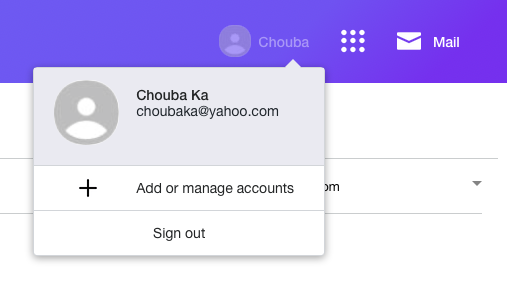

Go to the [security page](https://login.yahoo.com/myaccount/security/)

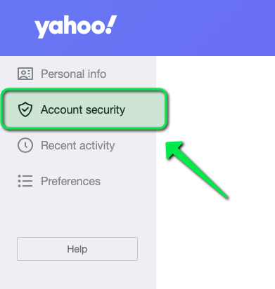

Find "Other way to sign in" and click on generate app password

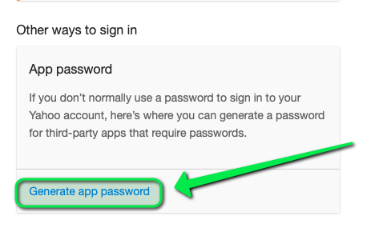

Type grafana as the name of the app but it could be whatever you want.

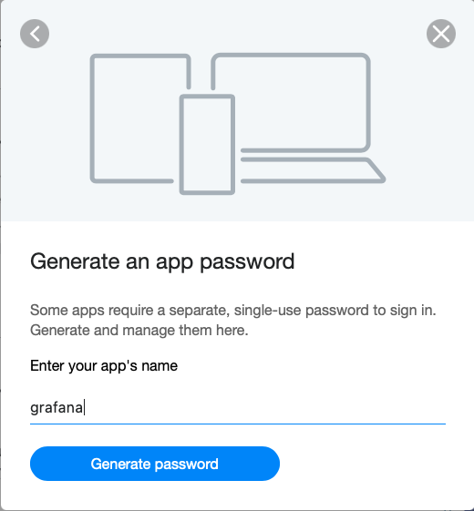

Copy the password in my case it's `osildlyfxvrjvasg`

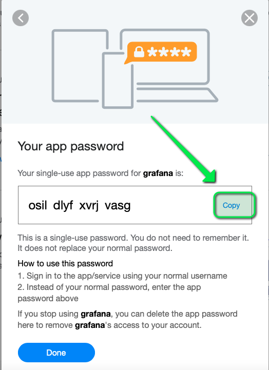

This step is necessary because grafana has limited capacity to connect to modern smtp server.

# Configure grafana

Grafana is configured through the k10-grafana configmap.

In this configmap we defined the content of grafana.ini, we need to change it to add the smtp
section and restart the grafana pod.

Obtain the configmap to edit it :
```
kubectl get cm -n kasten-io k10-grafana -o yaml > k10-grafana-cm.yaml
```

At the end of the grafana.ini section add the smtp element

```
    [smtp]
    enabled=true
    host=smtp.mail.yahoo.com:465
    user=choubaka@yahoo.com
    password=osildlyfxvrjvasg
    from_address=choubaka@yahoo.com
    from_name=choubaka
```

Of course if you directly copy this values it won't work this password and account has been deleted.

Now replace the config map with the new values

```
kubectl replace -f k10-grafana-cm.yaml
```

And rollout the grafana deployment
```
kubectl -n kasten-io rollout restart deployment/k10-grafana
```

# Create an email channel and test it

Grafana define the notion of alert channel.
An alert channel let you choose which channel you want to map to wich alert.

Let's go to the grafana dashboard Usage & report > More charts

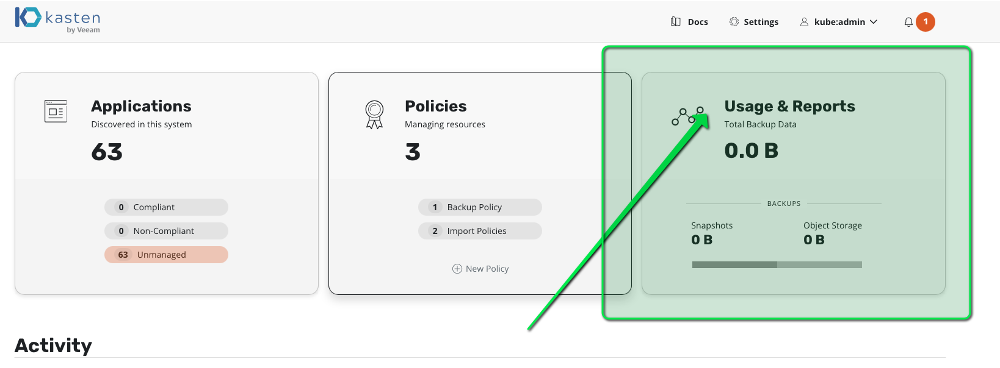

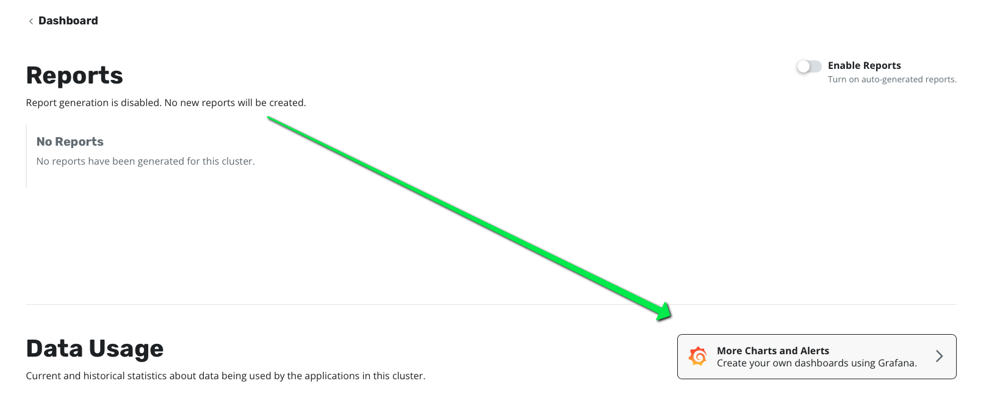

Click on Alerting > Notification channels > Add Channel

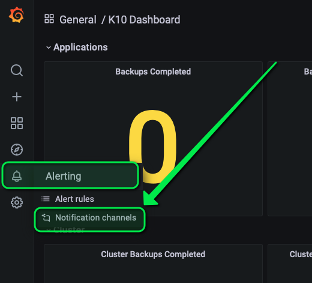

And choose Type: Email, name: email-channel, Adresses: <AN_EMAIL_YOU_CAN_CHECK> (in my case I used my email michael.courcy@gmail.com but of course use one that you can control)

And click test.

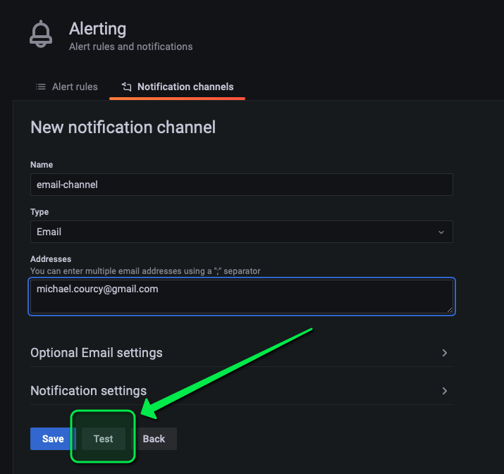

You must obtain a success

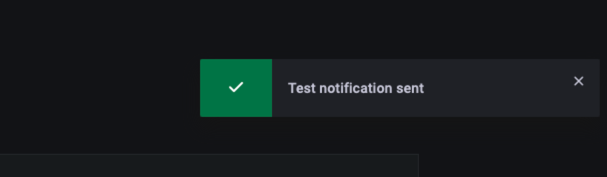

Check you mail box and verify that you get the mail from grafana

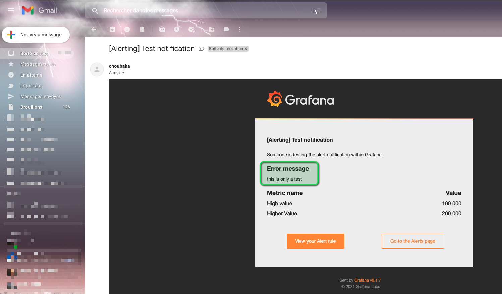

At this point you're all good to start working on alert rules.

Save the channel.


