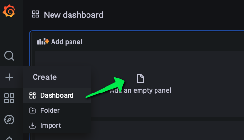
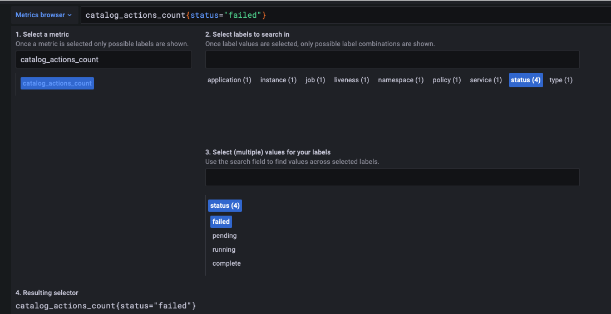
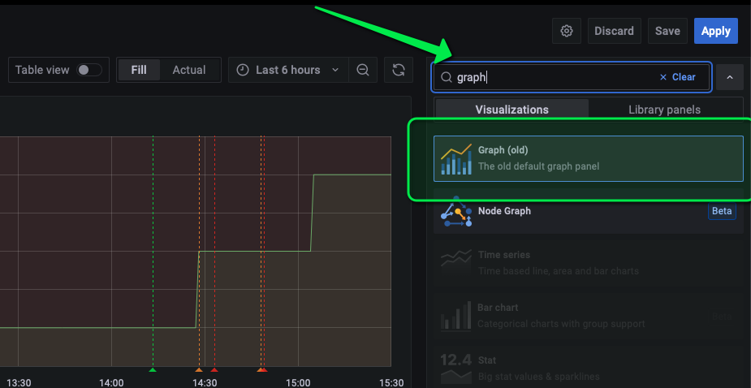
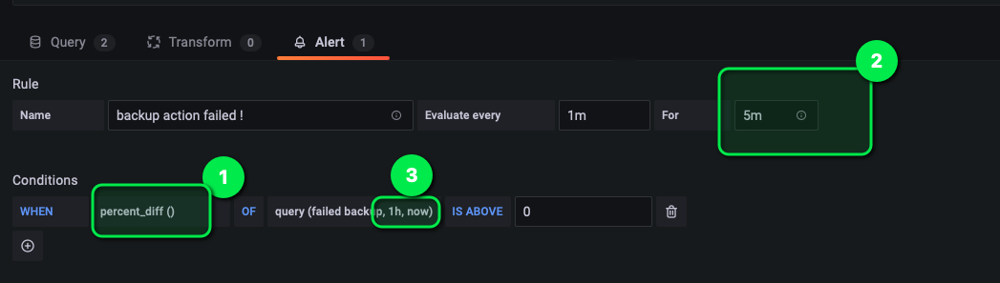
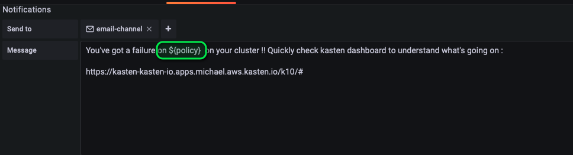
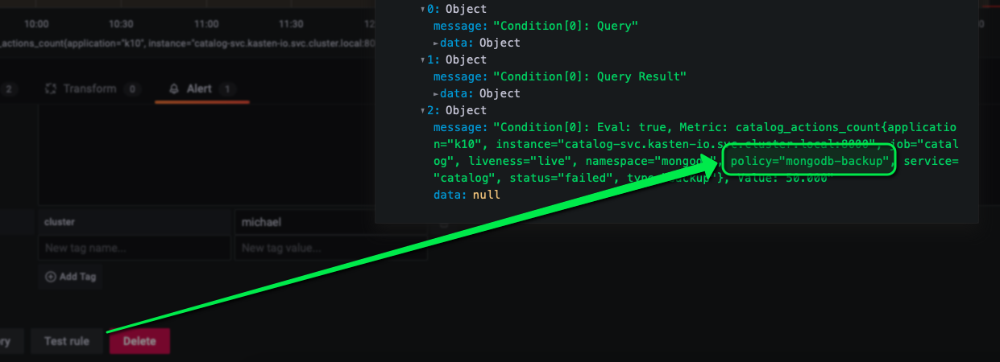
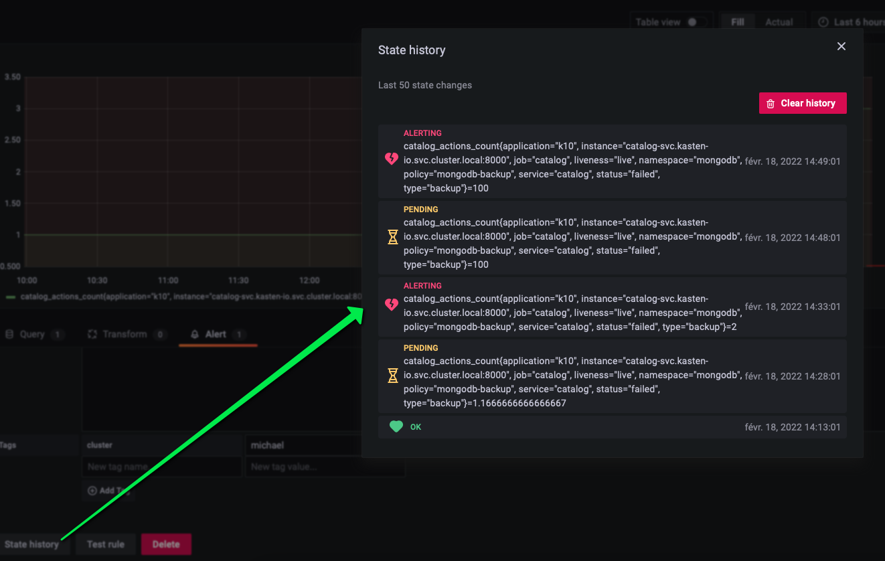
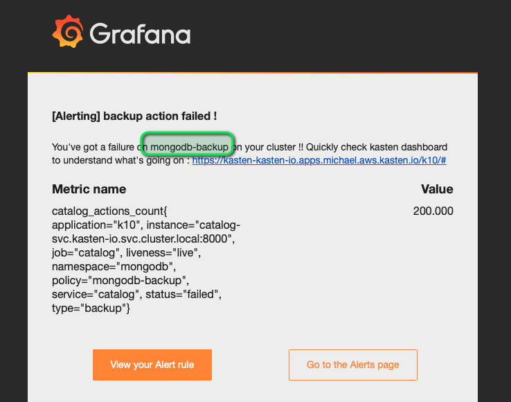

# Create a new dashboard

Call it "Alert dashboard"



Use the metrics browser to create `catalog_actions_count{status="failed"}`



Rename 'A' to 'failed backup'

Choose old graph



Go on the alert tab and create an alert based on `percent_diff > 0`



```
percent_diff = (newest - oldest) / math.Abs(oldest) * 100
```

percent_diff
- (1) will trigger an alert if the number of backup_failed just increase (percent_diff > 0).
- (2) Once the alert is on it stays on pending state for 5 minute, after this time it transitions on alerting. It's only when transitioned on alerting state that the alert is sent to the notification channel.
- (3) newest = now and oldest = now - 1h

# Define the channel as email-channel and template your message



Copy and paste this template message
```
cat <<EOF
You've got a failure on \${policy}  on your cluster !! Quickly check kasten dashboard to understand what's going on :

https://k8svm-32000-${INSTRUQT_PARTICIPANT_ID}.env.play.instruqt.com/k10/
EOF
```

Any criteria from the metrics can be used, in this case we use ${policy} to capture the name
of the policy that fails.

To find out the list of available criteria click on Test



Select the notification channel as "email-channel" that we created in the previous steps.

Save again to persist the alert rule.

# Test the alert rule

Now that the rule is created it's time to test it

Failed again the policy as you did the last time.

Once the policy is failed check the alertrule history



Check your mail within 10 minutes you must have received the alert.

Notice that `${policy}` has been replaced by the name of the policy "mongodb-backup".



Congratulation your alerting system is up and running, this is a very important component when
you manage a lot of clusters and a lot of policies on production.


