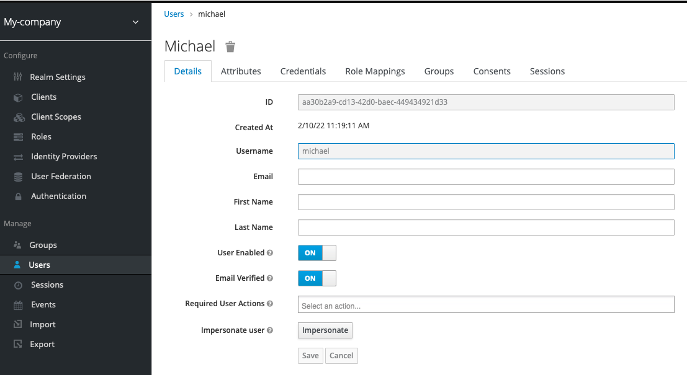
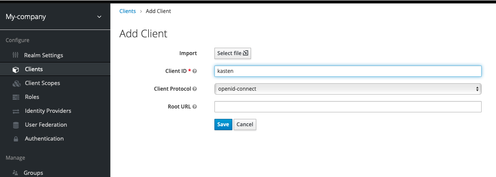
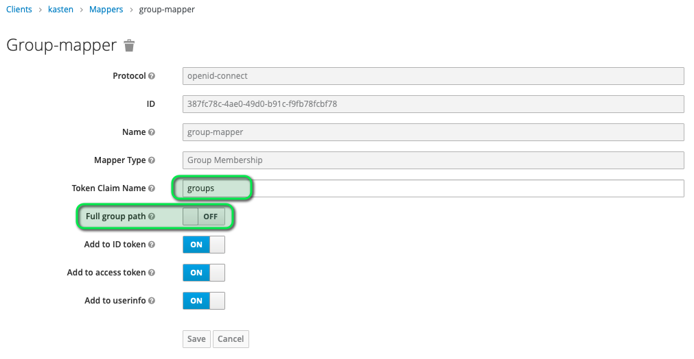

# Let's create a keycloak instance

Use the keycloak terminal to lauch keycloak
```
docker run -d --name=keycloak -p 8080:8080 -e KEYCLOAK_USER=admin -e KEYCLOAK_PASSWORD=admin quay.io/keycloak/keycloak:16.1.1
```

Wait few seconds that keycloak finish starting.
You can control that by searching the sentence `Admin console listening on http://127.0.0.1:9990` in the logs.

```
docker logs keycloak -f
```

Use Ctrl-C to get out of the logs.

Once keycloak started let's configure keycloak to accept non https protocol, securing the OIDC provider is not the objective
of this track and we take here the shortest path.

```
docker exec -it keycloak bash
```

Change the configuration of the master realm.
```
cd /opt/jboss/keycloak/bin/
./kcadm.sh config credentials --server http://localhost:8080/auth --realm master --user admin
```
Password is admin.

Now set up the configuration
```
./kcadm.sh update realms/master -s sslRequired=NONE
exit
```

You can now open a browser tab to the keycloak url
```
echo http://keycloak.${INSTRUQT_PARTICIPANT_ID}.instruqt.io:8080/
```

and click on the administraion console link.

The login and password were setup in the docker command it's admin/admin.

# Create the my-company realm

We create a new realm call "my-company"


Make sure this realm has also SSL not required


## Create a k10admin group and a user in this group

Create an admin group k10admin (we'll add other group later)


Create the user michael belonging to the k10admingroup. Make sure it has his email verified.


Setup the password as michael (same as username for simplicity but feel free to use something else).
Turn off temporary.


Make sure it has his email verified



## Create a kasten client in the realm

Create a kasten client in the realm my-company.
Make sure the client is Enabled.



Make sure this client is confidential and accept implicit flow (implicit flow is needed for using oidcdebugger)


On the allowed redirect add
- https://oidcdebugger.com/debug
- the url of the k10 oidc redirect endpoint (even if kasten has not been created we know what will be the URL)
```
echo http://k8svm.${INSTRUQT_PARTICIPANT_ID}.instruqt.io:32000/k10/auth-svc/v0/oidc/redirect
```


To add the groups in the JWT token add the group mapper,
- Disable Full group path.
- For name choose what you want (ie group-mapper)
- For Token Claim Name choose `groups`




# Let see what will be the JWT token returned by keycloak

In a new browser tab go to https://oidcdebugger.com/  use

```
curl http://keycloak.${INSTRUQT_PARTICIPANT_ID}.instruqt.io:8080/auth/realms/my-company/.well-known/openid-configuration | jq '.authorization_endpoint'
```

to fill up the field form


Then click send and connect as michael/michael

You should be redirected to oidc-debugger with the content of the JWT Token

```
{
   "exp": 1644490827,
   "iat": 1644490527,
   "auth_time": 1644490072,
   "jti": "1857a3b2-ada4-4b21-8449-c058e88a3601",
   "iss": "http://keycloak.5vubxfv1zp9p.instruqt.io:8080/auth/realms/my-company",
   "aud": "kasten",
   "sub": "aa30b2a9-cd13-42d0-baec-449434921d33",
   "typ": "ID",
   "azp": "kasten",
   "nonce": "ornkyd457rq",
   "session_state": "9d014d1d-170f-48f1-907f-0824339bc04d",
   "c_hash": "NhhY4mDF9yaZjl9qu7Gaxw",
   "acr": "0",
   "sid": "9d014d1d-170f-48f1-907f-0824339bc04d",
   "email_verified": true,
   "preferred_username": "michael",
   "groups": [
      "k10admin"
   ]
}
```

Congratulation your keycloak configuration is successful.

# More user and groups

Now in keycloak in the my-company realms create 3 groups dev, test and prod

And those users :

*  dev-user1/dev6v3p9gy, dev-user2/dev6v3p9gy, dev-user3/dev6v3p9gy belonging to the dev group
*  test-user1/test6v3p9gy, test-user2/test6v3p9gy, test-user3/test6v3p9gy belonging to the test group
*  prod-user1/prod6v3p9gy, prod-user2/prod6v3p9gy, prod-user3/prod6v3p9gy belonging to the prod group
*  devops-user1/devops6v3p9gy belonging to the dev, test and prod group

We'll use them latter when testing with RBAC.