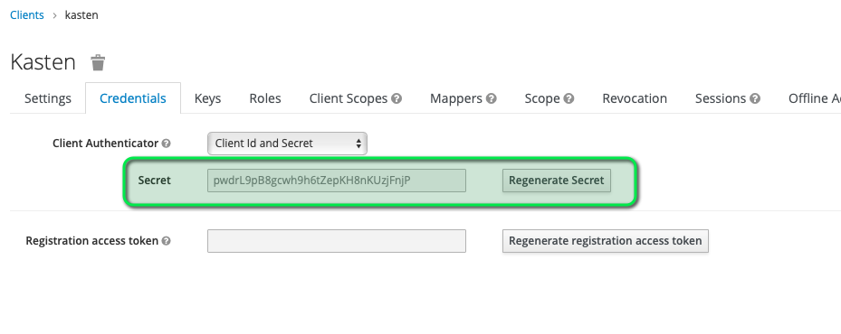
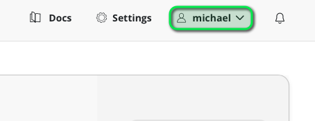
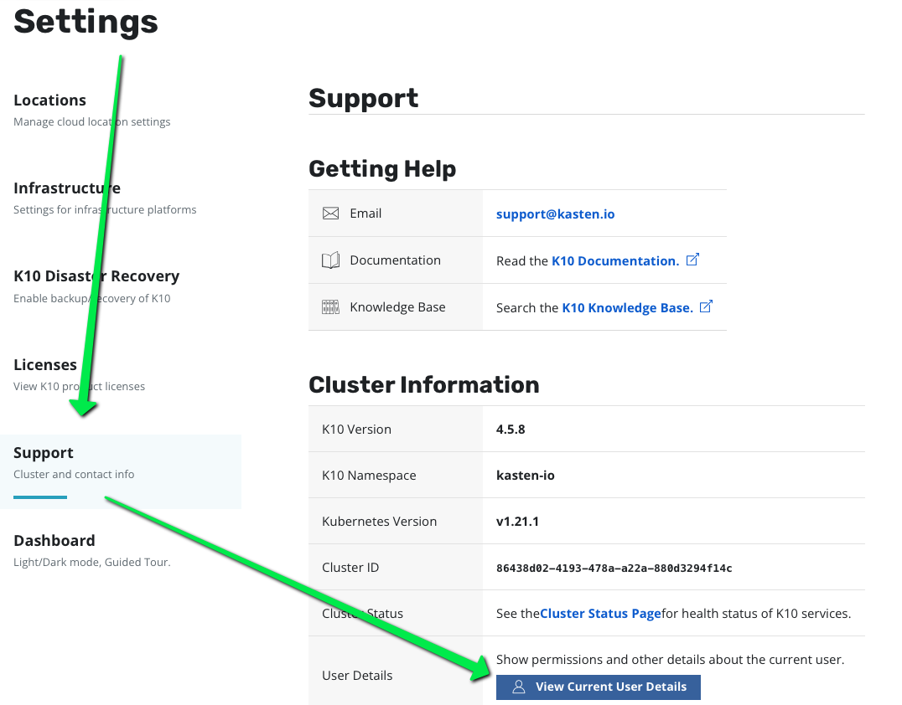
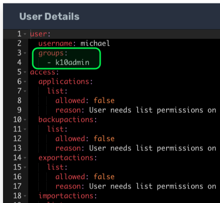
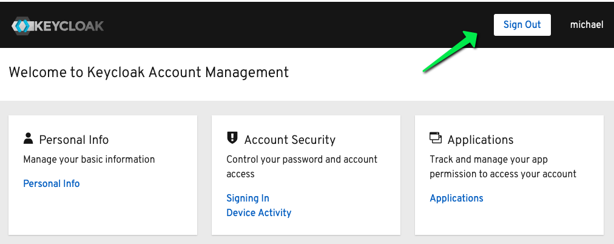
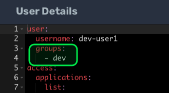
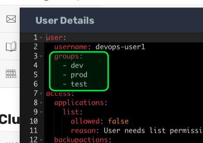
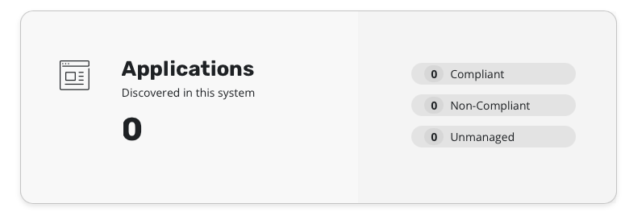

In this step, we will actually install K10 with those oidc options.

But as it becomes a complex install instead of using `--set option`
we're going to use a values.yaml file.

```
cat <<EOF > values.yaml
auth:
  oidcAuth:
    enabled: true
    clientID: kasten
    clientSecret: <kasten-secret>
    providerURL: http://keycloak.${INSTRUQT_PARTICIPANT_ID}.instruqt.io:8080/auth/realms/my-company
    redirectURL: http://k8svm.$INSTRUQT_PARTICIPANT_ID.instruqt.io:32000/
    scopes: "openid email profile"
    usernameClaim: preferred_username
    groupClaim: groups
    usernamePrefix: "-"
EOF

```
The options you can read are consistent with the OIDC provider we've setup
and the content of the JWT token we checked in the oidcdebugger.

Those options are described [here](https://docs.kasten.io/latest/access/authentication.html#openid-connect-authentication).


Notice particulary this option about the client secret which is used when working with authorisation code flow and confidential client:

```
    clientSecret: <kasten-secret>
```

You can find the secret in the credential tab of the kasten client in Keycloack.



Replace the value of the secret in the values.yaml file.

Let's install now :
```console
helm repo add kasten https://charts.kasten.io/
helm repo update
kubectl create ns kasten-io
kubectl create -f /root/license-secret.yaml

helm install k10 kasten/k10 --namespace kasten-io -f values.yaml
```


To ensure that Kasten K10 is running, check the pod status to make sure they are all in the `Running` state:
```console
watch -n 2 "kubectl -n kasten-io get pods"
```

Once all pods have a Running status, hit `CTRL + C` to exit `watch`.

# Configure the Local Storage System

Once K10 is running, use the following commands to configure the local storage system.
```console
kubectl annotate volumesnapshotclass csi-hostpath-snapclass k10.kasten.io/is-snapshot-class=true
```

# Expose the K10 dashboard

While not recommended for production environments, let's set up access to the K10 dashboard by creating a NodePort. Let's first create the configuration file for this:

```console
cat > k10-nodeport-svc.yaml << EOF
apiVersion: v1
kind: Service
metadata:
  name: gateway-nodeport
  namespace: kasten-io
spec:
  selector:
    service: gateway
  ports:
  - name: http
    port: 8000
    nodePort: 32000
  type: NodePort
EOF
```

Now, let's create the actual NodePort Service

```console
kubectl apply -f k10-nodeport-svc.yaml
```
# View the K10 Dashboard and check your identity

Once completed, you should be able to view the K10 dashboard in the other tab on the left.

You'll be redirected to the keycloak login window if you have not been authentified.

Identify first as michael/michael and check you have proper username



And check the groups you belong to :
groups Settings > Support > View Current User Details





# Logout

For different reasons that are beyond the scope of this track we decide to
not trigger a logout at the oidc provider level when you logout as michael.

If you simply logout from Kasten you will be automatically logged in again
because you are still logged in at the oidc provider.

You need to explicitly open the OIDC provider page

```
echo http://keycloak.${INSTRUQT_PARTICIPANT_ID}.instruqt.io:8080/auth/realms/my-company/account/#/
```



Now you can singn out on kasten and sign in again with another user

# Login as dev-user1, dev-user2 and devops-user1 and check groups

Now login as dev-user1 or dev-user2 and check your group, you should see in both case one group : dev.



Log out and login as devops-user1 you should see 3 groups dev, test and prod



# Conclusion

Our connection between the OIDC provider and Kasten is working really well and leave
us a great flexibility in managing group membership

But for the moment whatever the user there is nothing we can do ...

Tiles show 0 applications and 0 policies. How that happens ?



It's here that RBAC will come into play, and that's for the next challenges.


